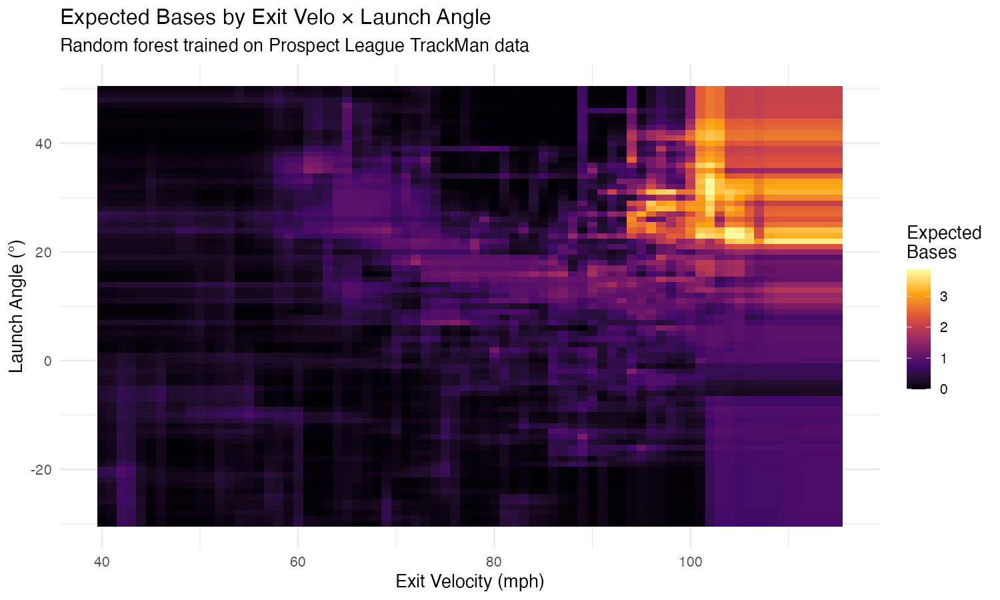

# Prospect League Run Production Model

A batting simulator and expected stats system for the Prospect League, built from play-by-play XML archives and TrackMan pitch-level data.

The core idea: use exit velocity and launch angle off the bat to estimate what a hitter's stat line *should* look like, independent of luck on balls in play and then feed those expected rates into a lineup simulator to project team-level run production.


*Random forest trained on 4,490 Prospect League batted balls. The barrel zone — 95+ mph, 20–30° — shows up clearly.*

---

## What it does

**Expected stats from TrackMan data.** A random forest classifier takes every batted ball's exit velocity and launch angle and predicts the probability of each outcome (out, single, double, triple, home run).

**Lineup simulation.** A Markov chain simulator walks through innings plate appearance by plate appearance, drawing events from each batter's rate profile and advancing runners according to historical state transitions. It handles batting order carry-over across innings and produces full scoring distributions, not just averages. Swapping in expected rates for observed rates lets you project what a lineup *should* score based on contact quality rather than what it *has* scored.

**Run expectancy validation.** The simulator's per-state run expectancy matches the empirical run expectancy matrix computed from the same dataset, confirming the two are the same process seen from different angles.

**Run Expectancy Article:**https://cornbeltersbaseball.com/run-expectancy-matrix-for-the-prospect-league/

---

## Key results

- **105 hitters** with expected stat lines (minimum 30 PA in TrackMan data, as of 6/9/26, will update periodically)
- Model accuracy of **71%** on held-out batted balls, with the expected caveat that singles are hard to distinguish from outs on EV/LA alone (bloop singles and soft fly outs look identical off the bat)
- Launch angle is the **more important feature** (MeanDecreaseGini 953 vs 852 for exit velo) — angle sorts batted balls into grounders, liners, and fly balls, which is the primary determinant of outcome type
- The Cornbelters' expected scoring rate projects **~0.5–0.8 runs/game higher** than their observed rate, suggesting the lineup has been somewhat unlucky on contact, although some of that gap is model optimism from not accounting for defensive quality

---

## Project structure

```
├── README.md
├── xbases_heatmap.png
├── .gitignore
├── notebooks/
│   ├── matrix_dev.ipynb                     # Run expectnacy matrix from game logs
│   ├── prospect_league_simulator_p1.ipynb   # Markov chain inning simulator
│   └── prospect_league_sim_p2.ipynb         # Lineup simulator + expected stats integration
├── model/
│   └── xtstats_script.R                     # TrackMan expected stats model (random forest)
├── output/
│   └── expected_rates.csv                   # Per-player expected event rates
└── data/
    └── README.md                            # Data sources (not included)
```

---

## Methodology

### Data

- **Play-by-play:** ~154,000 plate appearances across 1,983 games (2022–2026 Prospect League seasons), parsed from PrestoSports XML game files
- **TrackMan:** ~29,000 pitches from the 2026 season, yielding 4,490 batted balls with valid exit velocity and launch angle

### Simulator engine

Each base-out state (24 possible: 8 base configurations × 3 out counts) maps to a distribution of next states, learned from historical transitions. Simulating an inning means repeatedly sampling from these distributions until three outs. The lineup version rotates through a batting order, drawing each batter's event type (out, walk, single, double, triple, homer) from their individual rate profile, then drawing the runner advancement from the league-wide state transition table.

This two-stage approach — batter determines *what happens*, league averages determine *where runners go* — lets you isolate each hitter's contribution while keeping base-running dynamics realistic.

### Expected stats model

A random forest classifier (500 trees, 2 features) trained on exit velocity and launch angle to predict batted-ball outcomes. For expected stats, the model's predicted *probabilities* matter more than its classifications — a batted ball assigned 60% out / 30% single / 10% double contributes that full probability vector to the batter's expected profile, smoothing out the noise that individual classification accuracy misses.

Strikeout and walk rates pass through from the raw data unchanged. These are plate discipline metrics, not contact quality metrics, so the model doesn't touch them. The final expected event rates combine:

```
P(out)    = K_rate + BIP_rate × P(out | ball in play)
P(walk)   = BB_rate
P(single) = BIP_rate × P(single | ball in play)
...
```

Errors and fielder's choices are treated as outs in the training data — the model estimates what *should* happen given the contact, not what *did* happen given the fielding.

### Limitations

- The model uses only exit velocity and launch angle. Spray angle, park dimensions, and defensive positioning all affect outcomes but aren't captured.
- Triples are rare in the training data (n=50) and poorly classified. Their probability estimates are approximate.
- Expected stats assume league-average defense. A hitter facing consistently strong outfield defense will appear "unlucky" when they may just be facing good fielders.
- Small sample sizes at the player level (30–55 PA) mean individual expected stat lines carry meaningful noise. These are better as directional signals than precise estimates.

---

## Tools

- **Python** (pandas, matplotlib): data parsing, simulation, visualization
- **R** (tidyverse, randomForest, caret, ggplot2): batted-ball model, expected stats computation, heatmap
